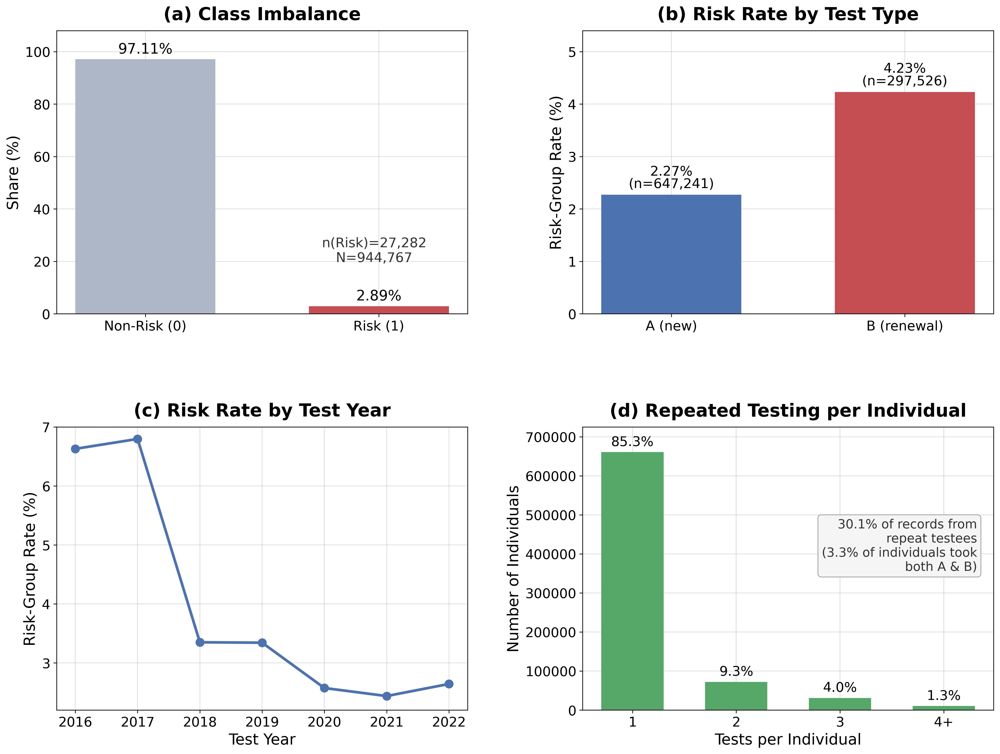
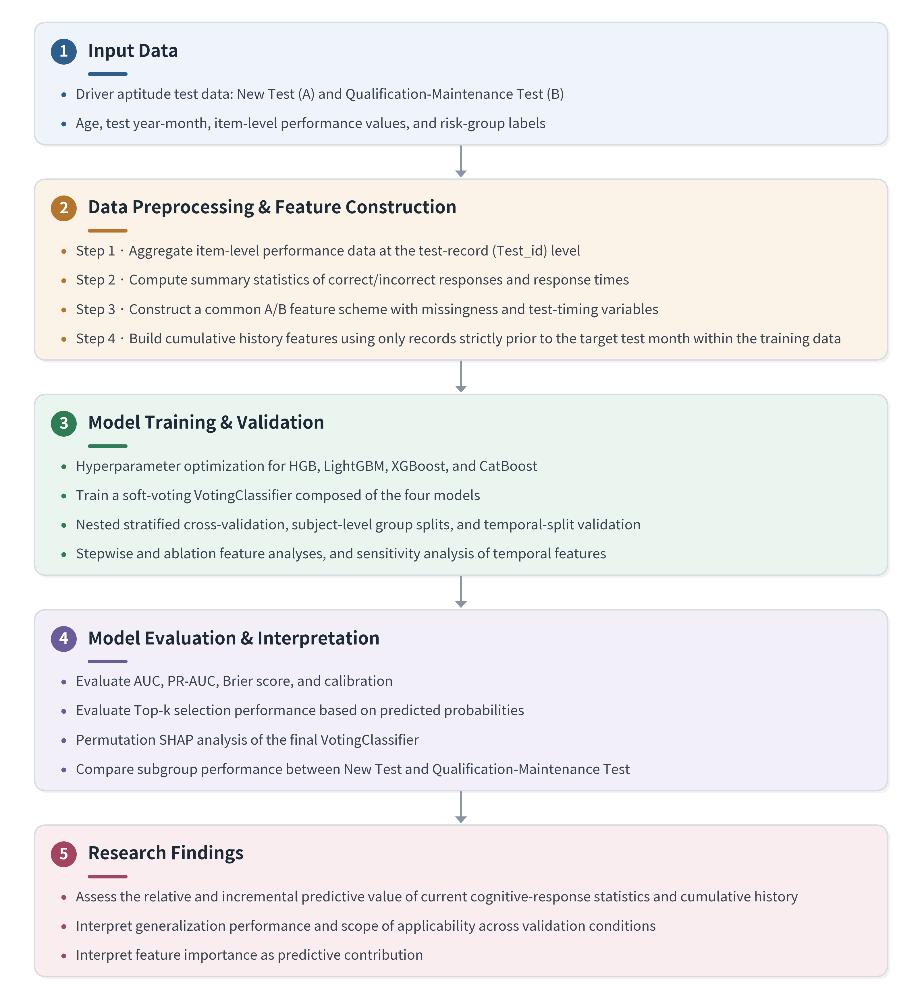
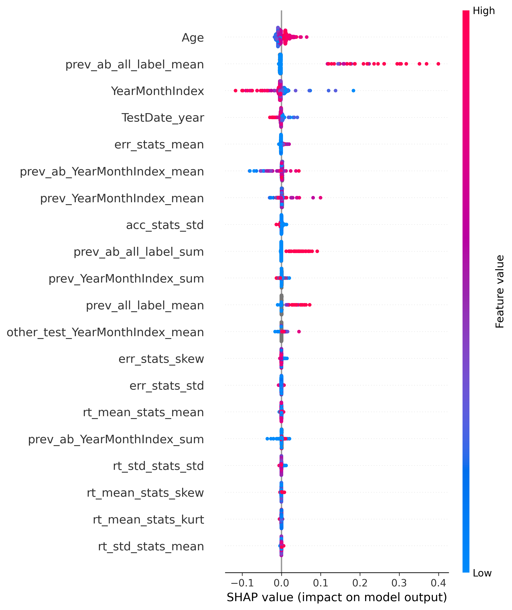
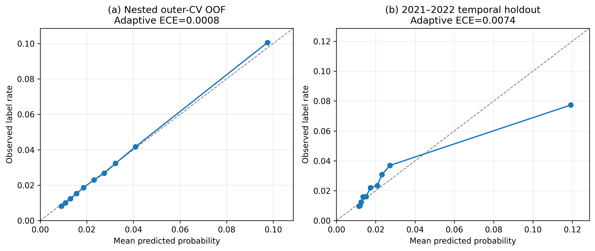

# 검사이력과 인지·반응 통계를 활용한 운수종사자 운전적성정밀검사 위험군 라벨 예측

**Risk-Group Label Prediction in Driver Aptitude Tests for Transportation Workers Using Test History and Cognitive-Response Statistics**

이성만 · 노건태 · 이관수 · 천지영 · 강태선 · 박형규 | 「교통안전연구」, 2026

[재현 가이드](REPRODUCIBILITY.md) · [데이터 안내](DATA.md) · [논문 표 전체](tables/manuscript_ready_tables.md) · [인용정보](CITATION.cff)

## 연구 개요

본 연구는 운수종사자 운전적성정밀검사에서 현재 인지·반응 정보가 예측시점 이전 검사이력에 더하여 제공하는 조건부 예측가치와 적용조건별 일반화 범위를 검토하였다. 신규검사(A)와 자격유지검사(B) 944,767건에서 두 검사에 공통적으로 적용할 수 있는 37개 피처를 구성하고, 이력 피처를 각 학습자료에서만 다시 생성하는 외부 5-fold 중첩 교차검증으로 네 가지 그래디언트 부스팅 모델과 결합모델을 평가하였다.

이 연구의 핵심은 새로운 알고리즘의 제안이 아니라 다음 세 질문을 하나의 누수 차단 평가체계에서 검증한 데 있다.

1. 검사이력과 현재 인지·반응 정보를 결합했을 때 위험군 라벨을 어느 정도 선별할 수 있는가?
2. 연령·검사시점·과거 검사이력 이후 현재 인지·반응 정보가 추가로 제공하는 예측가치는 어느 정도인가?
3. 미관측 개인, 미래기간, 검사유형 및 상위 k% 선별조건에서 성능과 보정도는 어떻게 달라지는가?

모델 출력은 실제 교통사고 발생확률이나 운전적성정밀검사의 공식 판정이 아니라, 데이터셋에서 제공된 위험군 라벨에 대한 **검사건 단위 우선순위 지표**로 해석한다.

## 분석자료와 공통 피처

| 항목 | 내용 |
|---|---:|
| 전체 검사기록 | 944,767건 |
| 신규검사(A) | 647,241건 |
| 자격유지검사(B) | 297,526건 |
| 위험군 라벨 비율 | 2.8877% |
| 최종 공통 피처 | 37개 |

위험군 라벨은 사고·위반 이력과 동일 코호트 내 상대기준을 결합한 데이터셋 제공 변수이다. 공통 피처는 연령·검사시점 4개, 과거·교차 검사이력 16개, 정확도·오류 통계 8개, 반응시간 통계 8개, 결측수 피처 1개로 구성하였다. A와 B의 고유 문항을 하나의 절대척도로 등치하지 않고, 두 검사에서 동일한 계산규칙과 해석을 적용할 수 있는 수행 수준·변동성 요약통계만 공통 피처로 사용하였다.



## 평가설계



평가설계의 주요 원칙은 다음과 같다.

- 외부 검증자료의 라벨이 이력 피처에 유입되지 않도록, 각 fold의 학습자료만 이력 원천으로 사용하였다.
- 동일 개인의 이력도 예측 대상 검사월보다 엄격히 이전인 기록만 사용하고 동일 연월 기록은 제외하였다.
- 외부 5-fold 중첩 교차검증에서 HistGradientBoosting, LightGBM, XGBoost, CatBoost를 각각 튜닝하였다.
- 네 모델의 예측확률을 soft voting으로 결합하고, `VotingClassifier.predict_proba()`의 직접 출력을 최종 확률로 사용하였다.
- PrimaryKey 완전분리와 2016–2020년 학습·2021–2022년 검증의 시간분할로 적용조건별 일반화를 평가하였다.

## 핵심 결과

### 기준모델 및 결합모델 성능

| Model | AUC | PR-AUC |
|---|---:|---:|
| DummyClassifier | 0.5000 | 0.0289 |
| LogisticRegression | 0.6900 | 0.1186 |
| HistGradientBoosting | 0.7191 | 0.1565 |
| LightGBM | 0.7192 | 0.1573 |
| XGBoost | 0.7193 | 0.1571 |
| CatBoost | 0.7190 | 0.1581 |
| **Soft-voting VotingClassifier** | **0.7197** | **0.1582** |

최종 결합모델은 동일한 37개 피처를 사용한 로지스틱 회귀보다 AUC가 0.0297, PR-AUC가 0.0396 높았다. 이는 위험군 라벨 예측에서 비선형 관계와 피처 간 상호작용을 반영한 모델이 단순 선형 기준모델보다 높은 순위 변별력을 제공했음을 보여준다.

### 현재 인지·반응 정보의 조건부 증분가치

| Feature Set | AUC | PR-AUC |
|---|---:|---:|
| Age/timing + history (Model B) | 0.7179 | 0.1551 |
| Full features (Model D) | 0.7197 | 0.1582 |
| **D − B** | **+0.0018** | **+0.0031** |

현재 인지·반응 요약통계를 추가했을 때 성능 증가는 크지 않았지만, 증가 방향은 5개 외부 fold에서 일관되었다. 결합 OOF 예측에 대한 PrimaryKey 군집 부트스트랩에서도 ΔAUC의 95% 구간은 0.001194–0.002596, ΔPR-AUC의 95% 구간은 0.002082–0.003634로 모두 0보다 컸다. 따라서 현재 검사정보는 누적 이력이 확보된 조건에서 **작지만 일관된 추가 신호**를 제공한다.

### 이력 가용성과 일반화

| Evaluation Condition | AUC | PR-AUC |
|---|---:|---:|
| Main nested CV, history included | 0.7197 | 0.1582 |
| Main outer folds, history excluded | 0.6750 | 0.0569 |
| PrimaryKey-disjoint CV, history excluded | 0.6743 | 0.0567 |
| 2021–2022 temporal holdout | 0.6924 | 0.0939 |

이력정보를 제외한 조건에서 개인 중복 허용과 PrimaryKey 완전분리의 AUC 차이는 0.0006이었다. 완전분리 조건의 성능 저하는 미관측 개인 자체보다 예측시점에 사용할 수 있는 누적 검사이력의 부재와 더 밀접하게 관련된 것으로 해석하였다.

시간분할에서 예측확률 상위 5% 검사건의 위험군 라벨 비율은 11.37%, 향상도(lift)는 4.47배, 누적 재현율은 22.34%였다. 이 결과는 제한된 검토자원을 상위 위험구간에 배분하는 운영 시나리오를 정량화한다.

## 모델 해석



5개 외부 fold의 permutation SHAP을 집계한 결과, `Age`, `YearMonthIndex`, `prev_ab_all_label_mean`, `TestDate_year`와 정확도·오류 관련 요약통계가 주요 피처로 나타났다. 37개 피처 순위의 fold 쌍별 Spearman 상관계수는 평균 0.881이었고, 상위 5개 피처의 평균 일치율은 92.0%였다.

이 중요도는 모델 내부의 예측 기여를 나타내며 인과효과를 의미하지 않는다. 특히 연령과 검사시점은 인지·반응 특성뿐 아니라 검사대상자 구성, 검사 운영환경 및 후속 사고·위반 라벨 분포의 변화를 함께 반영할 수 있다.

## 확률 보정도



결합 OOF의 분위구간 ECE는 0.0008이었지만 2021–2022년 시간분할에서는 0.0074로 증가하였다. 미래기간에 적용할 때는 순위 성능뿐 아니라 확률 보정의 이동도 함께 점검하고 필요하면 시점별 재보정을 수행해야 한다.

## 실무·정책적 해석

- 모델 출력은 공식 판정을 대체하거나 자동 불이익을 부과하는 수단이 아니다.
- 보수교육 안내, 정밀상담 또는 추가검사 검토 대상의 우선순위를 정하는 보조정보로 활용할 수 있다.
- 이전 검사이력을 조회할 수 있는 검사건과 이력이 없는 검사건은 서로 다른 정보조건이므로, 집단별로 성능과 상위 k%를 산출해야 한다.
- 실제 도입 전에는 미래기간 재검증, 시점별 재보정, 검사유형·연령 등 하위집단별 성능 및 공정성 점검이 필요하다.

## 저장소 구성

| 경로 | 내용 |
|---|---|
| [`figures/`](figures/) | 논문 그림 1–4와 그림 2 편집용 SVG |
| [`tables/`](tables/) | 논문 표 1–11, 수치 ledger와 자원 manifest |
| [`revision/`](revision/) | 기준모델, 이력 가용성 및 5-fold SHAP 상세·보조 분석 |
| [`REPRODUCIBILITY.md`](REPRODUCIBILITY.md) | 설치, 데이터 배치, 전체·부분 재현 및 검증 절차 |
| [`DATA.md`](DATA.md) | 데이터 출처, 비공개 범위와 이용조건 |

원자료, PrimaryKey, 검사건별 예측확률, fold별 이력 캐시와 실행 로그는 개인정보 및 배포조건 때문에 저장소에 포함하지 않는다. 코드는 [MIT License](LICENSE)로 배포하며, 데이터와 논문에는 원 배포처 및 학술지의 별도 이용조건이 적용된다.

## Citation

이 저장소를 활용할 때는 다음 논문을 인용해 주십시오. GitHub의 인용 기능에서 사용하는 기계판독형 정보는 [`CITATION.cff`](CITATION.cff)에 수록되어 있다.

> 이성만, 노건태, 이관수, 천지영, 강태선, 박형규 (2026). 검사이력과 인지·반응 통계를 활용한 운수종사자 운전적성정밀검사 위험군 라벨 예측. *교통안전연구*.

```bibtex
@article{lee2026riskgroup,
  author  = {Lee, Seung Man and Noh, Geon Tae and Lee, Kwan Su and Chun, Ji Young and Kang, Tae Sun and Park, Hyeong Gyu},
  title   = {Risk-Group Label Prediction in Driver Aptitude Tests for Transportation Workers Using Test History and Cognitive-Response Statistics},
  journal = {교통안전연구},
  year    = {2026}
}
```
