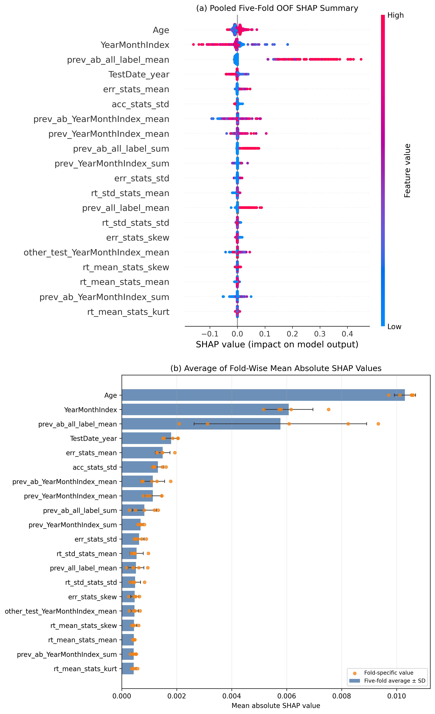
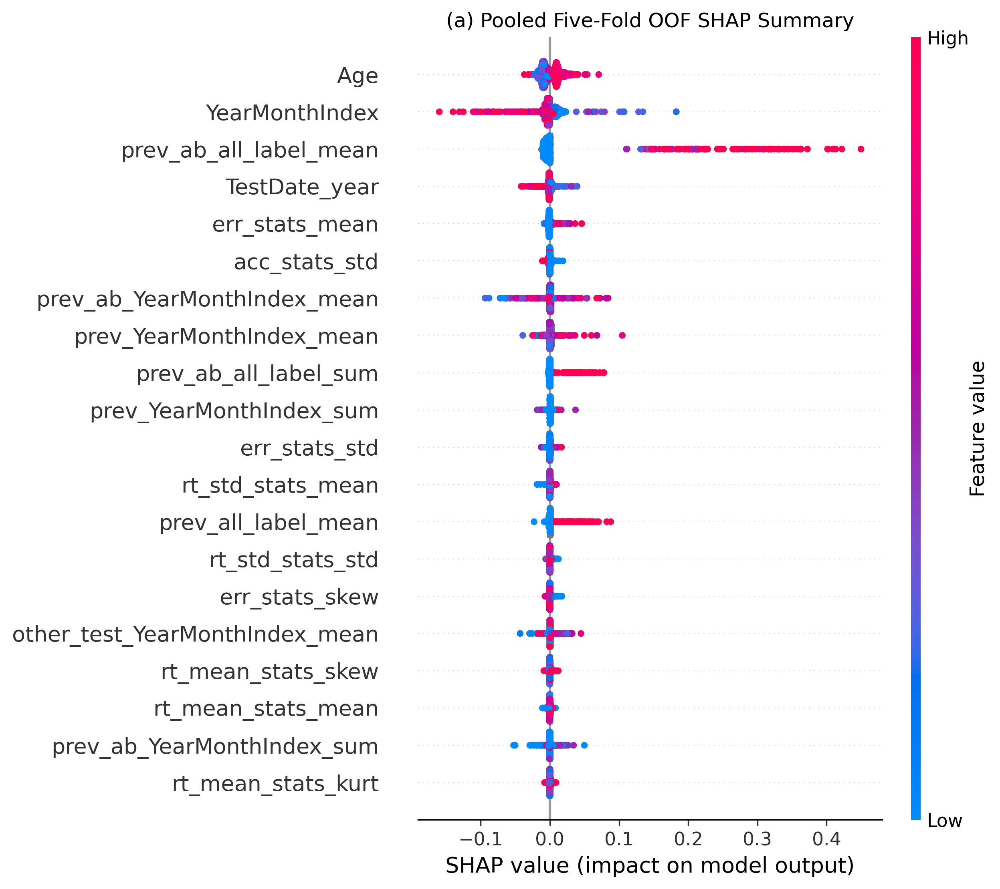
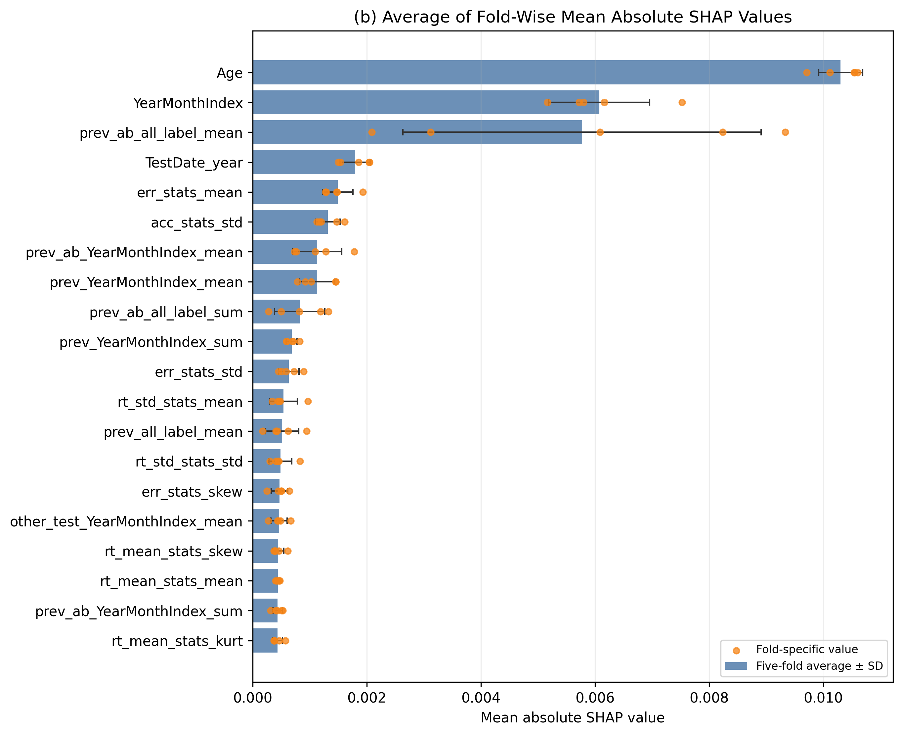
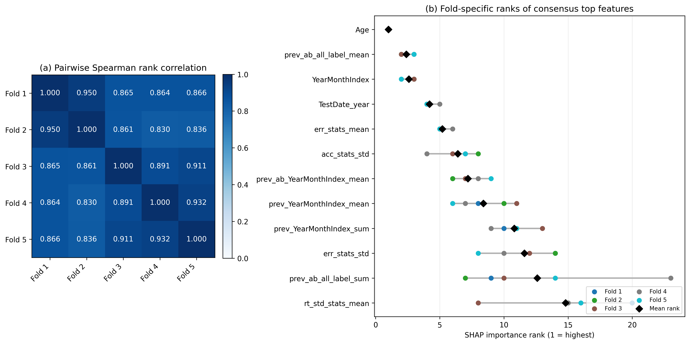

# 1차 심사 후 추가 분석

이 디렉터리는 1차 심사 의견에 따라 수행한 추가 분석의 코드와 최종 산출물을 제공한다. 원자료, 검사건별 예측확률, fold별 이력 캐시 및 개별 SHAP 배열은 개인정보·용량 문제로 포함하지 않는다. 모든 분석은 기본 재현 파이프라인과 동일한 5개 외부 fold 및 누수 차단 이력 생성 규칙을 사용한다.

## 분석 항목

### 단순 기준모델

`run_revision_analyses.py`는 다음 기준모델을 동일한 외부 5-fold에서 평가한다.

- `DummyClassifier(strategy="prior")`
- 중앙값 대치와 표준화를 포함한 `LogisticRegression(C=1.0)`
- 기존 최종 `VotingClassifier`의 외부 검증 예측

전처리는 각 외부 학습 fold에서만 적합하고 해당 검증 fold에 적용한다. 과거 검사이력도 외부 학습 파티션의 예측시점 이전 기록만을 원천으로 사용한다.

### 로지스틱 회귀 규제강도 튜닝

`tune_logistic_c.py`는 각 외부 학습 fold 안에서 3-fold 내부 교차검증을 수행한다. 후보값은 다음과 같다.

```text
C = 0.0001, 0.001, 0.01, 0.1, 1, 10, 100, 1000, 10000
```

내부 평균 `Score`가 가장 낮은 값을 선택한다. 외부 fold별 선택값은 100, 10000, 0.1, 1, 1이었으며, 튜닝 전후의 결합 OOF 성능 차이는 사실상 없었다. 논문에 사용한 최종 비교표는 `tables/table_revision_model_comparison.csv`이다.

### 5-fold SHAP 해석과 순위 안정성

`run_shap_fold_stability.py`는 각 외부 fold의 학습자료로 적합한 최종 VotingClassifier를 해당 외부 검증자료에 설명한다.

- 검증 설명표본: fold당 2,000건, 총 10,000건
- 학습 배경표본: fold당 100건
- permutation SHAP 평가횟수: 75
- 표본추출 난수 시드: fold별 42–46
- 피처 중요도: fold 내부 `mean(abs(SHAP))`
- fold 통합 중요도: 5개 fold 중요도의 단순 산술평균

37개 피처 순위의 fold 쌍별 Spearman 상관계수는 평균 0.881(범위 0.830–0.950)이었다. 상위 5개와 상위 10개 피처의 평균 일치율은 각각 92.0%와 81.0%였다.

## 실행 순서

먼저 저장소 루트에서 기본 재현 파이프라인을 실행하여 `runtime/strict_month_reanalysis/data`, `runtime/cache`, `runtime/results`를 생성한다. 이후 다음 명령을 순서대로 실행한다.

```powershell
python revision/run_revision_analyses.py
python revision/tune_logistic_c.py
python revision/run_shap_fold_stability.py
```

별도 작업경로를 사용하는 경우 기본 파이프라인과 동일하게 환경변수를 지정한다.

```powershell
$env:TRANSPORT_PAPER_RUNTIME="D:\transport_paper_runtime"
python revision/run_revision_analyses.py
python revision/tune_logistic_c.py
python revision/run_shap_fold_stability.py
```

중간 예측값과 SHAP 배열은 `revision/tmp/`에 저장되며 Git 추적 대상에서 제외한다. SHAP 계산을 처음부터 다시 수행하려면 다음과 같이 실행한다.

```powershell
python revision/run_shap_fold_stability.py --force
```

## 주요 결과 파일

### 기준모델 및 튜닝

- `tables/table_revision_model_comparison.csv`: 논문용 최종 모델 비교
- `tables/table_revision_model_comparison_fixed_c.csv`: 튜닝 전 `C=1.0` 비교
- `tables/table_revision_tuned_logistic_expanded_selected_c.csv`: 외부 fold별 선택 C
- `tables/table_revision_tuned_logistic_expanded_inner_summary.csv`: 내부 교차검증 결과
- `tables/table_revision_tuned_logistic_expanded_summary.csv`: 외부 검증 요약
- `tables/table_revision_tuned_logistic_expanded_differences.csv`: 튜닝 전후 및 최종모델과의 차이

### SHAP

- `tables/table_revision_shap_fold_importance.csv`: fold별 평균 절대 SHAP과 순위
- `tables/table_revision_shap_aggregate_importance.csv`: 5-fold 단순평균, 표준편차 및 순위 범위
- `tables/table_revision_shap_pairwise_spearman.csv`: fold 쌍별 순위상관
- `tables/table_revision_shap_topk_overlap.csv`: 상위 5·10·20개 피처 일치도
- `tables/table_revision_shap_fold_runtimes.csv`: fold별 계산시간

## 그림

논문 [그림 3]에는 두 패널을 세로로 결합한 다음 파일을 사용한다.



개별 패널 파일도 다음과 같이 함께 제공한다.





다음 그림은 fold 간 순위 일관성을 확인하기 위한 보조 산출물이다.


